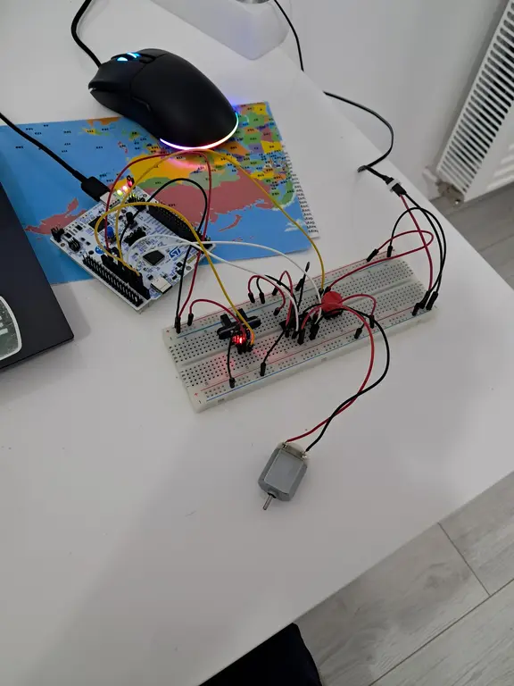
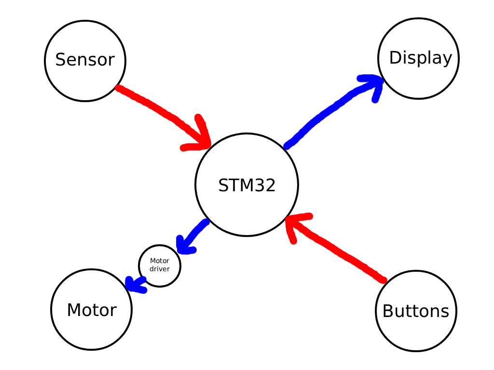

# Cash Counting Machine
A device that would count stack of banknotes and display the sum.

:::info 

**Author**: Oleksandr Kozoriz \
**GitHub Project Link**: https://github.com/UPB-PMRust-Students/fils-project-2026-sanyaswee

:::

<!-- do not delete the \ after your name -->

## Description

A simplified version of a cash counting machine, where the user would place a stack of banknotes in it and enter the value of one banknote. The machine would pull the banknotes one by one with a roller, count them using a beam interrupt sensor, and display the total sum.

## Motivation

It is quite interesting for me to build something that brings code to a physical world. I had no prior experince in embedded development, and this subject was a discovery for me. Seeing your code being executed in a real world is something facinating, and I am quite sure this project won't be my last one. Regarding this idea - it was the first one that came to my mind and was not done before, so - that's it!

## Architecture 

The user would place a stack of banknotes into the dedicated compartment. Then they would input the value of one banknote. After pressing the start button, the motor would pull the bottom banknote into a narrow slit, then, employing the gravity, the banknote would trigger the beam interrupt sensor, thus, increase the counter. If after a certain amount of time nothing triggers the sensor, the motor would stop. The front panel would feature the display, which would show the total sum along with the current value of one banknote; and a bunch of buttons, such as start, clear (set the counter and sum to 0), number inputs and preset banknote values (10/20/50/100 etc).


## Log

<!-- write your progress here every week -->

### Week 6
I have ordered all of the components, waiting for them to arrive.

### Week 7
All of the components have arrived, and I decided to build an MVP prototype fully on breadboard, without the screen and actual pulling mechanism, just the logic.



There were some issues, such as elecric noice generated by the spining motor interfering with the sensor signals. I had to add a capacitor and also filter the pulses in software, for now everything works fine. 

So I've finished the coding part, added a bit of concurrency and it works as expected, now, I am ready move on to the most important part - the actual pulling mechanism.

### Week 8
To be continued...

## Hardware

The "brain" of the system is **STM32 microcontroller** and the "eyes" of the system is **IR beam interruption sensor**.

The sensor has 3 terminals: *Vcc, GND* and *OUT*. *OUT* is high by default, and the sensor pulls it low only if there is something on the way of the beam (e.g. banknote)

Other main components are the **LCD display**, that is used as the information output; **DC motor and driver**, for pushing the banknote on the way of the sensor's beam; and the buttons for user interaction.



### Schematics

Place your KiCAD or similar schematics here in SVG format.

### Bill of Materials

<!-- Fill out this table with all the hardware components that you might need.

The format is 
```
| [Device](link://to/device) | This is used ... | [price](link://to/store) |

```

-->

| Device | Usage | Price |
|--------|--------|-------|
| [STM32 Nucleo-U545RE-Q](https://www.st.com/en/evaluation-tools/nucleo-u545re-q.html) | The microcontroller | [~130 RON*](https://ro.farnell.com/stmicroelectronics/nucleo-u545re-q/development-brd-32bit-arm-cortex/dp/4216396) |
| [Mini Infrared Interruption Sensor Module](https://www.optimusdigital.ro/en/all-products/5826-mini-infrared-interruption-sensor-module.html) | Detection of the passing banknote | [6.99 RON](https://www.optimusdigital.ro/en/all-products/5826-mini-infrared-interruption-sensor-module.html) |
| [1602 LCD with Blue Backlight 3.3 V](https://en.wikipedia.org/wiki/Liquid-crystal_display) | The main display | [19.99 RON](https://www.optimusdigital.ro/en/lcds/868-modul-lcd-1602-cu-backlight-galben-verde-de-33-v.html) |
| [DC Motor](https://en.wikipedia.org/wiki/DC_motor) | Pulling the banknotes into the slit | [3.99 RON](https://www.optimusdigital.ro/en/others/13612-dc-motor-f130-3v.html) |
| [L293D Motor Driver](https://www.ti.com/product/L293D) | The motor driver | [3 RON](https://www.optimusdigital.ro/en/brushed-motor-drivers/13613-driver-de-motoare-l293d.html) |
| [18 mm Rubber Wheel](https://en.wikipedia.org/wiki/Wheel) | The roller | [5 x 0.89 RON](https://www.optimusdigital.ro/en/gears/571-18-mm-rubber-wheel.html) |
| [2x150 mm Shaft](https://en.wikipedia.org/wiki/Shaft_(mechanical_engineering)) | The shaft for the roller | [1.95 RON](https://www.optimusdigital.ro/en/metal-axes/298-ax-metalic-2x150-mm.html) |
| [2x50 mm Shaft](https://en.wikipedia.org/wiki/Shaft_(mechanical_engineering)) | Shaft extention | [0.95 RON](https://www.optimusdigital.ro/en/metal-axes/312-ax-metalic-2x50-mm.html) |
| [2 mm to 2 mm Coupling Hub](https://en.wikipedia.org/wiki/Coupling) | Shaft connections | [2 x 5.99 RON](https://www.optimusdigital.ro/en/coupling-hubs/451-2mm-to-2mm-coupling-hub.html) |
| [Miniature Ball Bearing (2 mm Internal Diameter)](https://en.wikipedia.org/wiki/Bearing_(mechanical)) | Shaft support | [2.89 RON](https://www.optimusdigital.ro/en/bearings/402-rulment-in-miniatura-cu-diametru-interior-2-mm.html) |
| [4x4 Push Button Keyboard Matrix](https://www.electronicwings.com/sensors-modules/4x4-keypad-module) | User input | [3.99 RON](https://www.optimusdigital.ro/en/touch-sensors/2441-tastatura-matriceala-4x4-cu-butoane.html) |
| [Red Button with Round Cover](https://en.wikipedia.org/wiki/Push-button) | Start / Reset buttons | [2 x 1.99 RON](https://www.optimusdigital.ro/en/buttons-and-switches/1114-red-button-with-round-cover.html) |
| [Breadboard HQ (830 points)](https://en.wikipedia.org/wiki/Breadboard) | Prototyping | [9.98 RON](https://www.optimusdigital.ro/en/breadboards/8-breadboard-hq-830-points.html) |
| [Breadboard Jumper Wires Set](https://en.wikipedia.org/wiki/Jump_wire) | Wiring | [7.99 RON](https://www.optimusdigital.ro/en/wires-with-connectors/12-breadboard-jumper-wire-set.html) |
| [10 cm 10p Male-Female Wires](https://en.wikipedia.org/wiki/Jump_wire) | Wiring | [8 x 2.99 RON](https://www.optimusdigital.ro/en/wires-with-connectors/650-fire-colorate-mama-tata-10p.html) |
| [Cardboard](https://en.wikipedia.org/wiki/Cardboard) | CAD (Cardboard Aided Design) | [4.40 RON](https://www.dedeman.ro/ro/cutie-depozitare-din-carton-ctft-435-420-x-330-x-210-mm/p/1045878) |

*was borrowed from the lab


## Software

| Library | Description | Usage |
|---------|-------------|-------|
| [embassy-stm32](https://github.com/embassy-rs/embassy) | Hardware Abstraction Layer for STM32 microcontrollers | Controlling GPIOs and extrenal interrupts (EXTIs) |
| [embassy-sync](https://github.com/embassy-rs/embassy) | Synchronization primitives with async support | Mutexes and Watches for accessing the counter value |
| [embassy-time](https://github.com/embassy-rs/embassy) | Instant and Duration for embedded no-std systems, with async timer support | Debouncing and other timers |
| [embassy-executor](https://github.com/embassy-rs/embassy) | async/await executor | Spawning the processes |
| [embassy-futures](https://github.com/embassy-rs/embassy) | Utilities for working with futures | Awaiting results from multiple processes |
| [defmt](https://github.com/knurling-rs/defmt) | Logging framework for resource-constrained devices | Debug & Logging |
| [defmt-rtt](https://github.com/knurling-rs/defmt) | defmt log messages over the RTT protocol | Debug & Logging |
| [panic-probe](https://github.com/knurling-rs/defmt) | Panic handler that exits with an error code | Addressing errors |
| [cortex-m-rt](https://github.com/rust-embedded/cortex-m) | Minimal runtime / startup for Cortex-M microcontrollers | Embassy dependency |
| [hd44780-driver](https://github.com/JohnDoneth/hd44780-driver) | Driver HD44780 compliant displays | Displaying the output |
| [embedded-hal](https://github.com/JohnDoneth/hd44780-driver) | Hardware Abstraction Layer for embedded systems | Display driver's dependency |

## Links

<!-- Add a few links that inspired you and that you think you will use for your project -->

1. [Currency-counting machine](https://en.wikipedia.org/wiki/Currency-counting_machine)
2. [The Rust Book](https://doc.rust-lang.org/stable/book/index.html)
3. [Embassy](https://embassy.dev/)
