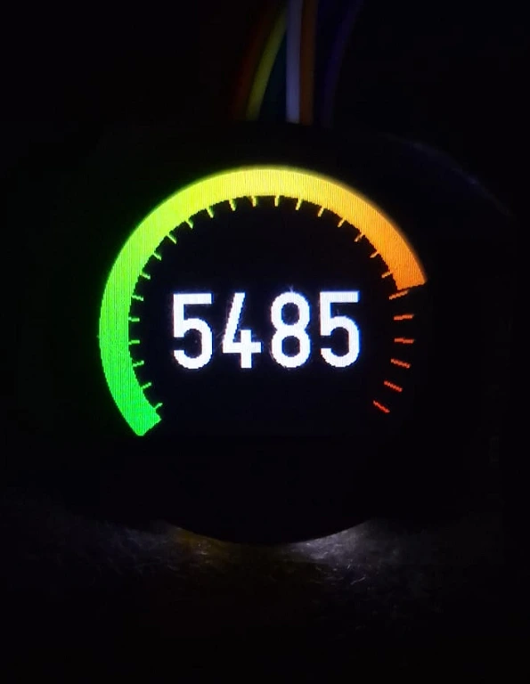

# Energy monitor
A device that analyzes electric power consumption

:::info 

**Author**: Țăranu Vladimir-Teodor \
**GitHub Project Link**: https://github.com/UPB-PMRust-Students/fils-project-2026-domnulvlad

:::

<!-- do not delete the \ after your name -->

## Description

The project involves a measurement device installed within a distribution box, which monitors AC power consumption in real-time, and a portable dashboard which displays live data. 

It operates by continuously sampling voltage and current sensors, to calculate the real power being consumed. The device processes analog data to determine the phase shift between the sine waves of voltage and current, which allows it to compute the [power factor](https://en.wikipedia.org/wiki/Power_factor).

The main (measurement) device features a built-in LCD, but considering distribution boxes may not be easily accessible, a secondary (dashboard) device, with a larger touchscreen LCD, communicates with the power meter to provide the user with the same data in a more convenient format and logs to an SD card.

Both devices are based around the [ESP32-C6](https://www.espressif.com/en/products/socs/esp32-c6), and they communicate wirelessly via the proprietary [ESP-NOW](https://www.espressif.com/en/solutions/low-power-solutions/esp-now) protocol. It is bidirectional, features fast data rates, low latency, and operates in the 2.4 GHz spectrum using Wi-Fi hardware.

## Motivation

I have always been interested in the efficiency of the devices we use every day, and the power factor is a very important part of this. Also, by having a system that provides a good estimate of your electricity consumption, you can stay aware of your habits and optimize them, to conserve energy and save some money on your bills.

## Architecture 

### Components

The system is divided into two independent devices which communicate wirelessly.

| Component | Interface |
|:------:|:-----:|
| Microcontrollers | ESP-NOW |
| Current sensor | variable voltage |
| Voltage sensor | variable voltage |
| Displays | MIPI-DSI |
| Touchscreen | SPI |
| SD card | SPI |

### Diagram

## Log

<!-- write your progress here every week -->

### Week 4-5

- Research
- Ordered parts
- Started working on software

### Week 6-8

Implemented on dashboard:
- simple code for an 8080-parallel LCD I had laying around, will be replaced with MIPI-DSI once the new display arrives
- only for testing, I implemented ESP-NOW communication in Arduino; will port to Rust

Implemented on measurement device:
- data processing algorithm (untested, sensors haven't arrived yet)
- basic ESP-NOW communication
- graphical gauge on the round LCD

### Week 9

Started working on this documentation.

## Hardware

Both the measurement device and the dashboard are based on the **ESP32-C6** microcontroller. They have built-in **ST7789** displays of different sizes.

The measurement device samples an **SCT-013** non-invasive current clamp a **ZMPT101B** isolated transformer module.

The dashboard's interface is controller by a resistive touchscreen processed by an **XPT2046**. For data storage, a standard **SD card** is used.

### Bill of Materials

| Device | Usage | Price |
|--------|--------|-------|
| [ESP32-C6](https://www.tme.eu/ro/details/esp32c6-wroom-1-n4/module-iot-wifi-bluetooth/espressif/esp32-c6-wroom-1-n4/) | Microcontrollers | 2 * 20 RON |
| [SCT-013](https://www.aliexpress.com/item/1005006325551071.html) | Non-invasive current clamp | 25 RON |
| [ZMPT101B](https://www.aliexpress.com/item/32810872584.html) | Isolated voltage transformer module | 15 RON |
| [0.96in ST7789](https://www.aliexpress.com/item/1005006258472043.html) | Display on measurement device | 25 RON (2 years ago) |
| [2.8in ST7789+XPT2046](https://www.aliexpress.com/item/1005009761383945.html) | Display on dashboard | 50 RON |

### Schematics

TODO

### Photos

TODO

## Software

### Crates

| Crate | Description | Usage |
|---------|-------------|-------|
| [esp-hal](https://github.com/esp-rs/esp-hal) | `no-std` hardware abstraction layer for ESP32 | Support for the ESP32-C6 |
| [embassy](https://github.com/embassy-rs/embassy) | Async framework | Cooperative multitasking |
| [mipidsi](https://github.com/almindor/mipidsi) | Generic MIPI-DSI driver | Driver for the ST7789 displays |
| [embedded-graphics](https://github.com/embedded-graphics/embedded-graphics) | 2D graphics library | Drawing graphics on the displays |
| [u8g2-fonts](https://github.com/Finomnis/u8g2-fonts) | U8g2 font system | Better fonts for `embedded-graphics` |
| [micromath](https://github.com/tarcieri/micromath) | Math library | Trigonometric functions |
| [bytemuck](https://github.com/Lokathor/bytemuck) | Safe byte operations | Serialization and deserialization for ESP-NOW data |

### Design

TODO

## Links

<!-- Add a few links that inspired you and that you think you will use for your project -->

1. [LCD tutorial](https://esp32.implrust.com/tft-display/index.html)
2. [SD card tutorial](https://esp32.implrust.com/sdcard/index.html)
3. [ESP-NOW example](https://github.com/esp-rs/esp-hal/tree/main/examples/esp-now/embassy_esp_now_duplex)
4. [Old Arduino library for energy monitoring](https://github.com/openenergymonitor/EmonLib)
